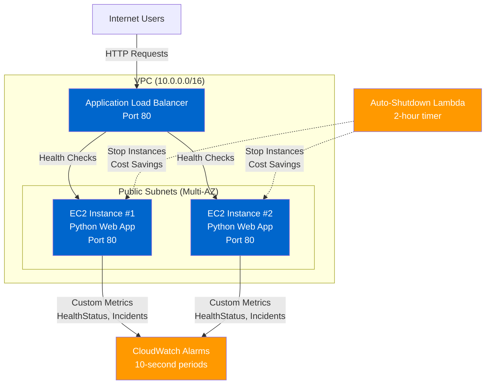

# AWS DevOps Agent Demo


A production-ready AWS infrastructure platform designed for **testing and validating DevOps AI agents' incident response capabilities**. This demo environment simulates real-world infrastructure incidents with fast CloudWatch alarms, automated recovery mechanisms, and comprehensive monitoring - perfect for training and validating AI-powered automation agents.

## Features

- **Interactive Dashboard**: Python-based web application with one-click incident simulation
- **6 Incident Types**: Unhealthy hosts, crashes, slow responses, 5xx floods, and shutdowns
- **Fast Alarms**: 10-second CloudWatch evaluation periods for rapid incident detection (2-4 minutes)
- **Auto-Recovery**: Built-in 5-minute recovery timer to automatically restore healthy state
- **Cost-Optimized**: Auto-shutdown Lambda stops instances after 2 hours, saving $50-100/month
- **GitHub Actions Integration**: Automated incident triggering via CI/CD workflows

---

## Table of Contents

1. [Quick Start](#quick-start)
2. [Architecture](#architecture)
3. [The Web Application](#the-web-application)
4. [Incident Simulation](#incident-simulation)
5. [Monitoring & Alarms](#monitoring--alarms)
6. [DevOps Agent Integration](#devops-agent-integration)
7. [Infrastructure Details](#infrastructure-details)
8. [Development](#development)
9. [Advanced Topics](#advanced-topics)
10. [Documentation Index](#documentation-index)
11. [Technical Reference](#technical-reference)

---

## Quick Start

Get the demo infrastructure running in under 5 minutes.

### Prerequisites

- AWS account with credentials configured
- Terraform >= 1.0 ([installation guide](https://learn.hashicorp.com/tutorials/terraform/install-cli))

### Deployment

```bash
# 1. Clone the repository
git clone <repository-url>
cd aws-devops-agent-demo

# 2. Initialize Terraform
terraform init

# 3. Deploy to dev environment
terraform apply -var-file=environments/dev/dev.tfvars

# 4. Get the application URL
terraform output -raw alb_url
```

### First Incident Test

```bash
# Get your ALB URL
ALB_URL=$(terraform output -raw alb_url)

# Trigger an unhealthy host incident via the dashboard
open ${ALB_URL}  # Opens interactive dashboard in browser

# Or trigger via curl
curl "${ALB_URL}/simulate/unhealthy"

# Check CloudWatch alarms (should trigger in 2-3 minutes)
# The system will auto-recover in 5 minutes
```

---

## Architecture

The infrastructure creates a complete testing environment with Application Load Balancer, EC2 instances, CloudWatch monitoring, and automated recovery.



### Components

| Component | Description | Purpose |
|-----------|-------------|---------|
| **VPC** | 10.0.0.0/16 network | Isolated network environment |
| **Application Load Balancer** | Internet-facing ALB | Routes traffic, health checks |
| **EC2 Instances** | t3.micro (default 2x) | Run Python web application |
| **Python Web App** | HTTP server on port 80 | Simulation endpoints, metrics |
| **CloudWatch Alarms** | 10-second evaluation periods | Fast incident detection |
| **Auto-Shutdown Lambda** | Runs every 2 hours | Cost savings for idle demos |
| **IAM Roles** | EC2 instance profile | CloudWatch metrics, SSM access |

### Network Architecture

- **Public Subnets**: Multi-AZ deployment for high availability
- **Internet Gateway**: Direct internet access for ALB
- **Security Groups**: ALB (port 80 ingress) → EC2 (port 80 from ALB only)
- **Route Tables**: Public routing to internet gateway

### Key Files

- **main.tf**: VPC, ALB, EC2 instances, networking
- **monitoring.tf**: CloudWatch alarms (lines 5-77)
- **auto_shutdown.tf**: Lambda function for cost optimization (lines 20-96)
- **templates/userdata.sh.tpl**: Python application installation

---

## The Web Application

A Python 3.12 HTTP server running as a systemd service on port 80, providing an interactive dashboard and simulation endpoints for incident testing.

### Overview

- **Technology**: Python 3 built-in `http.server` module
- **Deployment**: Systemd service with auto-restart
- **Metrics**: CloudWatch custom metrics via boto3
- **Auto-Recovery**: 5-minute timer for automatic health restoration

### Interactive Dashboard

Access the dashboard at your ALB URL to:
- View real-time health status
- Monitor instance information (ID, environment)
- Trigger incidents with one-click buttons
- View all available API endpoints
- Auto-refreshes every 5 seconds

### Simulation Endpoints

| Endpoint | Method | Description | Auto-Recovery |
|----------|--------|-------------|---------------|
| `/simulate/unhealthy` | GET | Fails health checks (returns 503) | 5 minutes |
| `/simulate/healthy` | GET | Restores healthy status (returns 200) | N/A |
| `/simulate/crash` | GET | Crashes application in 10 seconds | systemd restart |
| `/simulate/slow-health` | GET | Triggers slow/timeout responses | 5 minutes |

### Health Check Endpoint

**`GET /health`** - ALB health check endpoint

**Responses**:
- **200 OK**: `{"status": "healthy"}` - Instance is healthy
- **503 Service Unavailable**: `{"status": "unhealthy", "reason": "..."}` - Health check failing

ALB health check configuration:
- **Interval**: 30 seconds
- **Timeout**: 5 seconds
- **Healthy threshold**: 2 consecutive successes
- **Unhealthy threshold**: 2 consecutive failures

### CloudWatch Metrics

The application publishes custom metrics every 60 seconds:

| Metric | Values | Purpose |
|--------|--------|---------|
| **HealthStatus** | 1.0 (healthy) / 0.0 (unhealthy) | Track health state over time |
| **IncidentSimulations** | Count | Track incident trigger frequency |

**Namespace**: `CustomApp/HealthDemo`
**Dimensions**: InstanceId, Environment, IncidentType

### Auto-Recovery Feature

When triggering unhealthy or slow-health incidents, the application automatically schedules recovery:

- **Delay**: 300 seconds (5 minutes)
- **Action**: Restores `healthy = true` status
- **Cancellation**: Calling `/simulate/healthy` cancels pending recovery
- **Metrics**: Publishes updated health status to CloudWatch
- **Logging**: All recovery events logged to `/var/log/user-data.log`

This allows testing agent detection and response without manual intervention.

### Implementation Details

**Source**: `templates/userdata.sh.tpl` (lines 33-650)

**Key Features**:
- Python 3.12 with boto3 for AWS SDK
- Multi-threaded: Main HTTP server + background metrics publisher
- Graceful error handling for CloudWatch API failures
- IMDSv2 for secure instance metadata retrieval
- Systemd service with automatic restart on crash

**Systemd Service**:
```bash
# Check service status
sudo systemctl status webapp

# View logs
sudo journalctl -u webapp -f

# Restart service
sudo systemctl restart webapp
```

---

## Incident Simulation

Test DevOps agent incident response capabilities with 6 realistic failure scenarios.

### Overview

Incidents can be triggered via:
1. **Interactive Dashboard**: One-click buttons in web UI
2. **Direct API**: curl commands to ALB URL
3. **GitHub Actions**: Automated workflow (`.github/workflows/trigger-incidents.yml`)
4. **AWS SSM**: Direct commands to instances

All incidents generate CloudWatch alarms within 2-4 minutes for rapid agent testing.

### Incident Types

#### 1. Unhealthy Host (`unhealthy_host`)

**Behavior**: Single instance fails health checks
**Triggers**: `unhealthy-hosts` alarm (UnHealthyHostCount ≥ 1)
**Expected Alarm Time**: 2-3 minutes
**Auto-Recovery**: 5 minutes
**Use Case**: Test single-host failure detection and recovery

```bash
# Via API
curl "${ALB_URL}/simulate/unhealthy"

# Via GitHub Actions
gh workflow run trigger-incidents.yml \
  -f environment=dev \
  -f incident_type=unhealthy_host
```

#### 2. Unhealthy All Hosts (`unhealthy_all`)

**Behavior**: All instances fail health checks simultaneously
**Triggers**: `unhealthy-hosts` alarm (UnHealthyHostCount ≥ instance_count)
**Expected Alarm Time**: 2-3 minutes
**Auto-Recovery**: 5 minutes
**Use Case**: Test total service outage detection

```bash
# Via GitHub Actions (requires SSM)
gh workflow run trigger-incidents.yml \
  -f environment=dev \
  -f incident_type=unhealthy_all
```

#### 3. Application Crash (`crash_instance`)

**Behavior**: Application exits with code 1 after 10 seconds
**Triggers**: `unhealthy-hosts` alarm (systemd restarts app in ~5s)
**Expected Alarm Time**: 2-4 minutes
**Auto-Recovery**: systemd automatic restart
**Use Case**: Test application crash detection and systemd recovery

```bash
# Via API
curl "${ALB_URL}/simulate/crash"

# Note: Application responds "will crash in 10 seconds" then exits
```

#### 4. Slow Health Checks (`slow_health`)

**Behavior**: Health endpoint becomes unresponsive/slow
**Triggers**: `high-response-time` alarm (TargetResponseTime > 2s)
**Expected Alarm Time**: 2-3 minutes
**Auto-Recovery**: 5 minutes
**Use Case**: Test performance degradation detection

```bash
# Via API
curl "${ALB_URL}/simulate/slow-health"
```

#### 5. Shutdown Instances (`shutdown_instances`)

**Behavior**: Lambda function stops all EC2 instances
**Triggers**: All alarms (unhealthy hosts, response time, 5xx)
**Expected Alarm Time**: 3-5 minutes
**Auto-Recovery**: Manual (requires `aws ec2 start-instances`)
**Use Case**: Test infrastructure shutdown detection
**Requires**: `enable_auto_shutdown = true`

```bash
# Via GitHub Actions
gh workflow run trigger-incidents.yml \
  -f environment=dev \
  -f incident_type=shutdown_instances
```

#### 6. HTTP 5xx Error Flood (`http_5xx_flood`)

**Behavior**: Generates 15 concurrent HTTP 503 errors
**Triggers**: `5xx-errors` alarm (HTTPCode_Target_5XX_Count > 10)
**Expected Alarm Time**: 2-3 minutes
**Auto-Recovery**: None (errors are transient)
**Use Case**: Test error rate spike detection

```bash
# Via API (generate multiple requests)
for i in {1..15}; do
  curl -s "${ALB_URL}/simulate/unhealthy" &
done
wait
```

### GitHub Actions Workflow

For automated, repeatable incident testing with alarm monitoring and auto-restore capabilities.

**File**: `.github/workflows/trigger-incidents.yml`

**Features**:
- Infrastructure auto-discovery via Terraform outputs
- Pre-flight health checks
- CloudWatch alarm state monitoring
- Optional auto-restore with configurable delay
- Detailed execution summary with timelines

**Example Usage**:
```bash
# Trigger workflow via GitHub CLI
gh workflow run trigger-incidents.yml \
  -f environment=dev \
  -f incident_type=unhealthy_host \
  -f target_instance_index=0 \
  -f restore_after_incident=true \
  -f restore_delay_seconds=300 \
  -f wait_for_alarm=true
```

See [.github/workflows/README-incidents.md](.github/workflows/README-incidents.md) for comprehensive workflow documentation.

### Running Incidents via SSM

For direct instance access without SSH:

```bash
# Get instance ID
INSTANCE_ID=$(terraform output -json instance_ids | jq -r '.[0]')

# Trigger unhealthy via SSM
aws ssm send-command \
  --instance-ids ${INSTANCE_ID} \
  --document-name "AWS-RunShellScript" \
  --parameters 'commands=["curl http://localhost/simulate/unhealthy"]'

# Restore healthy
aws ssm send-command \
  --instance-ids ${INSTANCE_ID} \
  --document-name "AWS-RunShellScript" \
  --parameters 'commands=["curl http://localhost/simulate/healthy"]'
```

---

## Monitoring & Alarms

Fast CloudWatch alarms designed for rapid incident detection (10-second evaluation periods).

### CloudWatch Alarms

**Configuration**: `monitoring.tf` (enabled when `enable_monitoring = true`)

| Alarm Name | Metric | Threshold | Period | Evaluation | Expected Trigger Time |
|------------|--------|-----------|--------|------------|----------------------|
| **unhealthy-hosts** | UnHealthyHostCount | ≥ 1 | 10 seconds | 1 period | 2-3 minutes |
| **high-response-time** | TargetResponseTime | > 2 seconds | 10 seconds | 1 period | 2-3 minutes |
| **5xx-errors** | HTTPCode_Target_5XX_Count | > 10 | 10 seconds | 1 period | 2-3 minutes |

**Namespace**: `AWS/ApplicationELB`
**Dimensions**: TargetGroup, LoadBalancer

### Why 10-Second Periods?

Traditional CloudWatch alarms use 60-300 second periods. This demo uses **10-second periods** for:
- **Faster Detection**: Alarms trigger in 2-3 minutes vs 5-10 minutes
- **Better Agent Testing**: Rapid feedback loop for AI agent validation
- **Realistic Demo**: Keeps testing sessions short and interactive

**Trade-off**: Higher CloudWatch API costs (~$0.10/alarm/month). For production, use 60-300 second periods.

### Custom Metrics

Published by the Python application every 60 seconds:

**Namespace**: `CustomApp/HealthDemo`

| Metric | Values | Use Case |
|--------|--------|----------|
| **HealthStatus** | 1.0 / 0.0 | Track application health over time |
| **IncidentSimulations** | Count by type | Monitor incident testing frequency |

**Query Example**:
```bash
aws cloudwatch get-metric-statistics \
  --namespace CustomApp/HealthDemo \
  --metric-name HealthStatus \
  --dimensions Name=Environment,Value=dev \
  --start-time 2026-01-24T00:00:00Z \
  --end-time 2026-01-24T23:59:59Z \
  --period 300 \
  --statistics Average
```

### Monitoring Best Practices for Agent Testing

1. **Baseline First**: Deploy infrastructure and observe normal metrics for 10 minutes
2. **Document Timelines**: Record incident trigger → alarm transition times
3. **Test One Type at a Time**: Isolate variables for accurate agent validation
4. **Use Auto-Restore**: For repeatable automated testing
5. **Disable Auto-Restore**: When validating agent remediation actions
6. **Monitor CloudWatch Costs**: 10-second periods increase API usage

### Viewing Alarms

```bash
# List all alarms
aws cloudwatch describe-alarms \
  --query 'MetricAlarms[*].[AlarmName,StateValue]' \
  --output table

# Get specific alarm state
ALARM_NAME=$(terraform output -json cloudwatch_alarm_names | jq -r '.unhealthy_hosts')
aws cloudwatch describe-alarms --alarm-names ${ALARM_NAME}

# View alarm history
aws cloudwatch describe-alarm-history \
  --alarm-name ${ALARM_NAME} \
  --max-records 10
```

---

## DevOps Agent Integration

Configure and test AI-powered DevOps agents using this demo infrastructure.

### Setup Agent Environment

#### 1. AWS Credentials (Read-Only Recommended)

Grant your agent IAM permissions:

```json
{
  "Version": "2012-10-17",
  "Statement": [
    {
      "Effect": "Allow",
      "Action": [
        "cloudwatch:DescribeAlarms",
        "cloudwatch:GetMetricStatistics",
        "ec2:DescribeInstances",
        "elasticloadbalancing:DescribeTargetHealth",
        "elasticloadbalancing:DescribeLoadBalancers",
        "logs:GetLogEvents"
      ],
      "Resource": "*"
    }
  ]
}
```

For agent remediation testing, add:
```json
{
  "Effect": "Allow",
  "Action": [
    "ssm:SendCommand",
    "ec2:StartInstances",
    "ec2:RebootInstances"
  ],
  "Resource": "*",
  "Condition": {
    "StringEquals": {
      "aws:RequestedRegion": "us-east-1"
    }
  }
}
```

#### 2. Resource Discovery

Configure agent to discover infrastructure via tags:

```bash
# Get environment tag for filtering
ENVIRONMENT=$(terraform output -raw environment_tag)

# Discover EC2 instances
aws ec2 describe-instances \
  --filters "Name=tag:Environment,Values=${ENVIRONMENT}" \
  --query 'Reservations[*].Instances[*].[InstanceId,State.Name,Tags[?Key==`Name`].Value|[0]]'

# Get alarm names
terraform output -json cloudwatch_alarm_names
```

**Resource Tags**:
- `Environment`: dev/qa/prod (for filtering)
- `ManagedBy`: Terraform (automated provisioning)
- `Name`: Descriptive resource name

#### 3. Alarm Configuration

Provide agent with alarm names for monitoring:

```bash
terraform output cloudwatch_alarm_names

# Example output:
# {
#   "unhealthy_hosts": "dev-devops-demo-unhealthy-hosts",
#   "high_response_time": "dev-devops-demo-high-response-time",
#   "http_5xx_errors": "dev-devops-demo-5xx-errors"
# }
```

### Test Incident Detection Workflow

**Objective**: Validate agent can detect and diagnose incidents

#### Step 1: Trigger Incident

```bash
# Trigger unhealthy host incident
curl "${ALB_URL}/simulate/unhealthy"
echo "Incident triggered at $(date)"
```

#### Step 2: Wait for Alarm (2-4 minutes)

```bash
# Monitor alarm state
ALARM_NAME=$(terraform output -json cloudwatch_alarm_names | jq -r '.unhealthy_hosts')

while true; do
  STATE=$(aws cloudwatch describe-alarms \
    --alarm-names ${ALARM_NAME} \
    --query 'MetricAlarms[0].StateValue' \
    --output text)
  echo "[$(date +%H:%M:%S)] Alarm state: ${STATE}"
  [ "$STATE" == "ALARM" ] && break
  sleep 10
done
```

#### Step 3: Observe Agent Detection

Your agent should:
1. **Detect**: Identify alarm state change (polling or EventBridge)
2. **Identify**: Determine affected resources (EC2 instances, ALB target group)
3. **Diagnose**: Correlate alarm with health check failures
4. **Propose**: Suggest remediation actions

#### Step 4: Validate Proposed Remediation

**Expected Agent Output**:
```
Incident Detected: Unhealthy Host Alarm
- Alarm: dev-devops-demo-unhealthy-hosts
- Metric: UnHealthyHostCount = 1
- Affected Instance: i-0123456789abcdef0
- Root Cause: Health check endpoint returning 503

Proposed Remediation:
1. Restart application: systemctl restart webapp
2. Or restore via API: curl http://localhost/simulate/healthy
3. Or wait for auto-recovery (5 minutes)
```

### Expected Agent Capabilities

| Capability | Description | Validation Method |
|------------|-------------|-------------------|
| **Alarm Detection** | Detect CloudWatch alarm state changes | Trigger incident, verify agent logs |
| **Resource Correlation** | Identify affected EC2/ALB resources | Check agent identifies correct instances |
| **Root Cause Analysis** | Diagnose health check failures | Verify agent determines 503 response |
| **Remediation Proposal** | Suggest fix actions | Review proposed commands |
| **Action Execution** | Execute SSM commands or API calls | Test with read-write IAM permissions |
| **Recovery Validation** | Verify alarm returns to OK state | Confirm agent monitors post-fix |

### Test Auto-Remediation Actions

For agents with remediation capabilities (requires IAM permissions):

#### Restart Application via SSM

```bash
# Agent executes
INSTANCE_ID="<affected-instance>"
aws ssm send-command \
  --instance-ids ${INSTANCE_ID} \
  --document-name "AWS-RunShellScript" \
  --parameters 'commands=["sudo systemctl restart webapp"]'
```

#### Restore Health via API

```bash
# Agent executes
INSTANCE_ID="<affected-instance>"
aws ssm send-command \
  --instance-ids ${INSTANCE_ID} \
  --document-name "AWS-RunShellScript" \
  --parameters 'commands=["curl http://localhost/simulate/healthy"]'
```

#### Start Stopped Instances

```bash
# For shutdown_instances incident
INSTANCE_IDS=$(terraform output -json instance_ids | jq -r '.[]')
aws ec2 start-instances --instance-ids ${INSTANCE_IDS}
```

### Validate Recovery Checklist

After agent remediation, verify:

- [ ] Alarm state returned to OK (within 2-3 minutes)
- [ ] Target health shows "healthy" in ALB
- [ ] Application responds with 200 on `/health`
- [ ] CloudWatch metrics show HealthStatus = 1.0
- [ ] No new alarms triggered

### Example Agent Prompt

For testing AI agents with natural language interfaces:

```
You are a DevOps agent monitoring AWS infrastructure in us-east-1.

Environment: dev
Available Alarms:
- dev-devops-demo-unhealthy-hosts
- dev-devops-demo-high-response-time
- dev-devops-demo-5xx-errors

Task: Monitor CloudWatch alarms and respond to incidents.

When an alarm triggers:
1. Identify affected resources
2. Diagnose root cause
3. Propose remediation
4. Execute fix (if approved)
5. Validate recovery

Start monitoring now.
```

### Integration Patterns

#### Polling-Based

```python
# Poll CloudWatch every 30 seconds
while True:
    alarms = cloudwatch.describe_alarms(AlarmNames=alarm_list)
    for alarm in alarms['MetricAlarms']:
        if alarm['StateValue'] == 'ALARM':
            handle_incident(alarm)
    time.sleep(30)
```

#### Event-Driven (EventBridge)

```json
{
  "source": ["aws.cloudwatch"],
  "detail-type": ["CloudWatch Alarm State Change"],
  "detail": {
    "state": {
      "value": ["ALARM"]
    }
  }
}
```

#### API-Based (GitHub Actions Webhook)

Configure webhook to notify agent when incidents are triggered via workflow.

---

## Infrastructure Details

### Environment Configurations

Three pre-configured environments with different resource profiles:

| Setting | dev | qa | prod |
|---------|-----|-----|------|
| **Instance Type** | t3.micro | t3.small | t3.medium |
| **Instance Count** | 2 | 2 | 3 |
| **Auto-Shutdown** | Enabled (2hr) | Enabled (2hr) | Disabled |
| **Monitoring** | Enabled | Enabled | Enabled |
| **SSH Access** | Optional | Optional | Disabled |
| **Region** | us-east-1 | us-east-1 | us-east-1 |

**Cost Estimates** (with auto-shutdown):
- **dev**: ~$15-20/month (active 8 hours/day)
- **qa**: ~$25-30/month (active 8 hours/day)
- **prod**: ~$80-100/month (always-on, larger instances)

### Customization

Edit environment-specific tfvars files:

```hcl
# environments/dev/dev.tfvars
env                  = "dev"
region              = "us-east-1"
instance_type       = "t3.micro"
instance_count      = 2
enable_auto_shutdown = true
enable_monitoring   = true
enable_ssh_access   = false
```

**Common Customizations**:

```hcl
# Increase instance count for multi-host testing
instance_count = 4

# Use larger instances for performance testing
instance_type = "t3.small"

# Disable auto-shutdown for long-running tests
enable_auto_shutdown = false

# Enable SSH for direct instance access
enable_ssh_access    = true
ssh_allowed_cidrs   = ["1.2.3.4/32"]  # Your IP
key_pair_name       = "my-key"        # Existing EC2 key pair
```

Apply changes:
```bash
terraform apply -var-file=environments/dev/dev.tfvars
```

### Cost Optimization

#### Auto-Shutdown Lambda

**File**: `auto_shutdown.tf`
**Enabled by default**: dev, qa (disabled in prod)

**How It Works**:
1. EventBridge rule triggers Lambda every 2 hours
2. Lambda stops all EC2 instances in the environment
3. Saves ~60% on EC2 costs for idle demos

**Manual Control**:
```bash
# Stop instances manually
INSTANCE_IDS=$(terraform output -json instance_ids | jq -r '.[]')
aws ec2 stop-instances --instance-ids ${INSTANCE_IDS}

# Start instances
aws ec2 start-instances --instance-ids ${INSTANCE_IDS}
```

**Disable Auto-Shutdown**:
```hcl
# environments/dev/dev.tfvars
enable_auto_shutdown = false
```

**Cost Savings Example**:
- **Without auto-shutdown**: 2x t3.micro × 730 hours = $15/month
- **With auto-shutdown (8hr/day)**: 2x t3.micro × 240 hours = $5/month
- **Savings**: $10/month (67%)

#### Destroy When Not Needed

```bash
# Completely remove infrastructure
terraform destroy -var-file=environments/dev/dev.tfvars
```

### SSH Access (Optional)

**Default**: SSH disabled for security

**To Enable**:

1. Create EC2 key pair in AWS console
2. Update tfvars:
```hcl
enable_ssh_access = true
ssh_allowed_cidrs = ["YOUR_IP/32"]
key_pair_name     = "your-key-name"
```
3. Apply changes:
```bash
terraform apply -var-file=environments/dev/dev.tfvars
```
4. SSH to instance:
```bash
INSTANCE_IP=$(aws ec2 describe-instances \
  --instance-ids $(terraform output -json instance_ids | jq -r '.[0]') \
  --query 'Reservations[0].Instances[0].PublicIpAddress' \
  --output text)

ssh -i ~/.ssh/your-key.pem ec2-user@${INSTANCE_IP}
```

### Terraform State Backend

**Default**: Local state (`.terraform/terraform.tfstate`)

**For Team Collaboration**: Use S3 backend

Update `versions.tf`:
```hcl
terraform {
  backend "s3" {
    bucket         = "my-terraform-state-bucket"
    key            = "aws-devops-demo/terraform.tfstate"
    region         = "us-east-1"
    dynamodb_table = "terraform-state-locks"
    encrypt        = true
  }
}
```

Create backend resources:
```bash
# Create S3 bucket
aws s3 mb s3://my-terraform-state-bucket --region us-east-1

# Create DynamoDB table for locking
aws dynamodb create-table \
  --table-name terraform-state-locks \
  --attribute-definitions AttributeName=LockID,AttributeType=S \
  --key-schema AttributeName=LockID,KeyType=HASH \
  --billing-mode PAY_PER_REQUEST \
  --region us-east-1
```

---

## Development

### Local Setup

```bash
# Install pre-commit hooks (REQUIRED before first commit)
pre-commit install

# Initialize Terraform
terraform init

# Run pre-commit checks manually
pre-commit run --all-files

# Validate Terraform
terraform fmt -recursive
terraform validate

# Run TFLint (downloads AWS plugin first time)
tflint --init
tflint --config=.tflint.hcl

# Run Checkov security scan
checkov --config-file .checkov.yml

# Generate documentation
terraform-docs markdown table --output-file README.md .
```

### Pre-Commit Checks

Automatically run before each commit:

| Check | Purpose |
|-------|---------|
| **terraform_fmt** | Format .tf files |
| **terraform_validate** | Validate syntax |
| **terraform_docs** | Generate README documentation |
| **terraform_tflint** | Lint with AWS rules |
| **terraform_checkov** | Security scanning |
| **gitleaks** | Secret detection |
| **trailing-whitespace** | Fix whitespace |
| **check-yaml** | Validate YAML files |

**Configuration**: `.pre-commit-config.yaml`

### CI/CD Workflows

**Location**: `.github/workflows/`

| Workflow | Trigger | Purpose |
|----------|---------|---------|
| **pre-commit-ci.yaml** | Pull request | Run all quality checks |
| **terraform-aws.yml** | Manual (workflow_dispatch) | Deploy infrastructure |
| **trigger-incidents.yml** | Manual (workflow_dispatch) | Trigger incidents for testing |
| **release.yaml** | Push to main | Semantic versioning and changelog |

### Semantic Commits

Follow Conventional Commits for automated versioning:

```bash
# Patch version bump (1.0.0 → 1.0.1)
git commit -m "fix(monitoring): correct alarm threshold"

# Minor version bump (1.0.0 → 1.1.0)
git commit -m "feat(incidents): add new slow-response incident type"

# Major version bump (1.0.0 → 2.0.0)
git commit -m "feat(api): change health endpoint path

BREAKING CHANGE: health endpoint moved from /health to /api/v2/health"

# No version bump
git commit -m "docs: update README with new examples"
git commit -m "chore: update pre-commit hooks"
```

**Types**:
- `feat`: New feature (minor bump)
- `fix`: Bug fix (patch bump)
- `perf`: Performance improvement (patch bump)
- `refactor`: Code refactoring (patch bump)
- `docs`: Documentation only (no bump)
- `chore`: Maintenance tasks (no bump)
- `test`: Test additions (no bump)

### Branch Strategy

**Critical Rule**: NEVER commit directly to `main`

**Workflow**:
1. Create feature branch: `git checkout -b feat/your-feature`
2. Make changes with semantic commits
3. Push and create pull request
4. Wait for CI/CD checks to pass
5. Merge via pull request

**Branch Naming**:
- `feat/description` - New features
- `fix/description` - Bug fixes
- `chore/description` - Maintenance tasks

### DevContainer

Pre-configured development environment available:

```bash
# Open in VSCode
code .
# Prompt: "Reopen in Container" → Accept

# Or manually
docker-compose -f .devcontainer/docker-compose.yml up
```

**Includes**: Terraform, TFLint, Checkov, AWS CLI, pre-commit

For complete development guidelines, see [CLAUDE.md](CLAUDE.md).

---

## Advanced Topics

### Troubleshooting

#### Web App Not Responding

**Symptoms**: ALB returns 502/503 errors, health checks failing

**Diagnosis**:
```bash
# Check instance state
INSTANCE_ID=$(terraform output -json instance_ids | jq -r '.[0]')
aws ec2 describe-instances --instance-ids ${INSTANCE_ID} \
  --query 'Reservations[0].Instances[0].State.Name'

# Check service status via SSM
aws ssm send-command \
  --instance-ids ${INSTANCE_ID} \
  --document-name "AWS-RunShellScript" \
  --parameters 'commands=["systemctl status webapp"]'

# View application logs
aws ssm send-command \
  --instance-ids ${INSTANCE_ID} \
  --document-name "AWS-RunShellScript" \
  --parameters 'commands=["journalctl -u webapp -n 50"]'
```

**Solutions**:
1. Restart webapp: `systemctl restart webapp`
2. Check UserData logs: `/var/log/user-data.log`
3. Verify boto3 installed: `python3 -c "import boto3"`
4. Restart instance if needed

#### Alarms Not Triggering

**Symptoms**: Incident triggered but alarm stays OK

**Diagnosis**:
```bash
# Check alarm configuration
ALARM_NAME=$(terraform output -json cloudwatch_alarm_names | jq -r '.unhealthy_hosts')
aws cloudwatch describe-alarms --alarm-names ${ALARM_NAME}

# Check actual metric values
aws cloudwatch get-metric-statistics \
  --namespace AWS/ApplicationELB \
  --metric-name UnHealthyHostCount \
  --dimensions Name=TargetGroup,Value=$(terraform output -raw alb_arn | cut -d: -f6) \
  --start-time $(date -u -d '10 minutes ago' +%Y-%m-%dT%H:%M:%S) \
  --end-time $(date -u +%Y-%m-%dT%H:%M:%S) \
  --period 60 \
  --statistics Maximum

# Verify target health
aws elbv2 describe-target-health \
  --target-group-arn $(aws elbv2 describe-target-groups \
    --load-balancer-arn $(terraform output -raw alb_arn) \
    --query 'TargetGroups[0].TargetGroupArn' --output text)
```

**Solutions**:
1. Wait full evaluation period (10-60 seconds)
2. Verify instance actually unhealthy in ALB
3. Check alarm dimensions match resources
4. Confirm `enable_monitoring = true`

#### Auto-Shutdown Issues

**Symptoms**: Instances not stopping after 2 hours

**Diagnosis**:
```bash
# Check Lambda function
LAMBDA_ARN=$(terraform output -raw auto_shutdown_lambda_arn)
aws lambda get-function --function-name ${LAMBDA_ARN}

# Check EventBridge rule
aws events list-rules --name-prefix "dev-devops-demo-auto-shutdown"

# View Lambda logs
aws logs tail /aws/lambda/dev-devops-demo-auto-shutdown --follow
```

**Solutions**:
1. Invoke Lambda manually for testing
2. Check Lambda IAM permissions for ec2:StopInstances
3. Verify EventBridge rule is ENABLED
4. Check instance IDs in Lambda environment variables

### Multi-Region Deployment

Deploy to multiple regions using Terraform workspaces:

```bash
# Create workspace for us-west-2
terraform workspace new us-west-2

# Update provider region
export TF_VAR_region=us-west-2

# Deploy
terraform apply -var-file=environments/dev/dev.tfvars

# Switch back to us-east-1
terraform workspace select default
```

Or use separate state files per region:
```bash
# Deploy to us-east-1
terraform apply -var-file=environments/dev/dev.tfvars -var="region=us-east-1"

# Deploy to us-west-2 with different state
terraform apply -var-file=environments/dev/dev.tfvars -var="region=us-west-2" \
  -state=terraform-us-west-2.tfstate
```

### Custom Incident Types

Extend the web application with custom incidents:

**File**: `templates/userdata.sh.tpl` (line 545+)

**Example**: Add database connection failure simulation

```python
elif self.path == '/simulate/db-timeout':
    health_status["healthy"] = False
    health_status["reason"] = "Database connection timeout"
    health_status["last_updated"] = datetime.now().isoformat()
    schedule_auto_recovery(300)
    publish_health_metric()
    publish_incident_metric('db-timeout')
    self.send_json_response(200, {
        "message": "Simulating database timeout (auto-recovery in 5 minutes)"
    })
```

Redeploy:
```bash
terraform taint aws_instance.web[0]  # Force UserData re-run
terraform apply -var-file=environments/dev/dev.tfvars
```

### Integrate with External Monitoring

Send CloudWatch alarms to external systems:

**SNS Topics** (add to `monitoring.tf`):
```hcl
resource "aws_sns_topic" "alarms" {
  name = "${local.name_prefix}-alarm-notifications"
}

resource "aws_sns_topic_subscription" "email" {
  topic_arn = aws_sns_topic.alarms.arn
  protocol  = "email"
  endpoint  = "your-email@example.com"
}

# Add to alarms
resource "aws_cloudwatch_metric_alarm" "unhealthy_hosts" {
  # ... existing config ...
  alarm_actions = [aws_sns_topic.alarms.arn]
}
```

**Webhook Integration**:
```hcl
resource "aws_sns_topic_subscription" "webhook" {
  topic_arn = aws_sns_topic.alarms.arn
  protocol  = "https"
  endpoint  = "https://your-agent-endpoint.com/alarms"
}
```

---

## Documentation Index

| Document | Purpose |
|----------|---------|
| **README.md** (this file) | Main documentation, quick start, architecture |
| **[CLAUDE.md](CLAUDE.md)** | Development guidelines, branching strategy, CI/CD |
| **[BEST-PRACTICES.md](BEST-PRACTICES.md)** | Terraform best practices, security, performance |
| **[.github/workflows/README-incidents.md](.github/workflows/README-incidents.md)** | Comprehensive incident workflow documentation |
| **[CHANGELOG.md](CHANGELOG.md)** | Version history and release notes |
| **[LICENSE](LICENSE)** | MIT license terms |

### External Resources

- **Terraform AWS Provider**: https://registry.terraform.io/providers/hashicorp/aws/latest/docs
- **CloudWatch Alarms**: https://docs.aws.amazon.com/AmazonCloudWatch/latest/monitoring/AlarmThatSendsEmail.html
- **ALB Health Checks**: https://docs.aws.amazon.com/elasticloadbalancing/latest/application/target-group-health-checks.html
- **AWS SSM Session Manager**: https://docs.aws.amazon.com/systems-manager/latest/userguide/session-manager.html
- **Semantic Commits**: https://www.conventionalcommits.org/

---

## Technical Reference

Auto-generated Terraform documentation (updated by `terraform-docs` pre-commit hook).

<!-- BEGIN_TF_DOCS -->
## Requirements

| Name | Version |
|------|---------|
| <a name="requirement_terraform"></a> [terraform](#requirement\_terraform) | >= 1.0 |
| <a name="requirement_archive"></a> [archive](#requirement\_archive) | ~> 2.7 |
| <a name="requirement_aws"></a> [aws](#requirement\_aws) | ~> 6.28 |

## Providers

| Name | Version |
|------|---------|
| <a name="provider_archive"></a> [archive](#provider\_archive) | 2.7.1 |
| <a name="provider_aws"></a> [aws](#provider\_aws) | 6.28.0 |

## Modules

No modules.

## Resources

| Name | Type |
|------|------|
| [aws_cloudwatch_event_rule.auto_shutdown](https://registry.terraform.io/providers/hashicorp/aws/latest/docs/resources/cloudwatch_event_rule) | resource |
| [aws_cloudwatch_event_target.auto_shutdown](https://registry.terraform.io/providers/hashicorp/aws/latest/docs/resources/cloudwatch_event_target) | resource |
| [aws_cloudwatch_log_group.auto_shutdown](https://registry.terraform.io/providers/hashicorp/aws/latest/docs/resources/cloudwatch_log_group) | resource |
| [aws_cloudwatch_metric_alarm.high_response_time](https://registry.terraform.io/providers/hashicorp/aws/latest/docs/resources/cloudwatch_metric_alarm) | resource |
| [aws_cloudwatch_metric_alarm.http_5xx_errors](https://registry.terraform.io/providers/hashicorp/aws/latest/docs/resources/cloudwatch_metric_alarm) | resource |
| [aws_cloudwatch_metric_alarm.unhealthy_hosts](https://registry.terraform.io/providers/hashicorp/aws/latest/docs/resources/cloudwatch_metric_alarm) | resource |
| [aws_iam_instance_profile.ec2](https://registry.terraform.io/providers/hashicorp/aws/latest/docs/resources/iam_instance_profile) | resource |
| [aws_iam_role.ec2_instance](https://registry.terraform.io/providers/hashicorp/aws/latest/docs/resources/iam_role) | resource |
| [aws_iam_role.lambda_auto_shutdown](https://registry.terraform.io/providers/hashicorp/aws/latest/docs/resources/iam_role) | resource |
| [aws_iam_role_policy.lambda_ec2_stop](https://registry.terraform.io/providers/hashicorp/aws/latest/docs/resources/iam_role_policy) | resource |
| [aws_iam_role_policy_attachment.ec2_cloudwatch](https://registry.terraform.io/providers/hashicorp/aws/latest/docs/resources/iam_role_policy_attachment) | resource |
| [aws_iam_role_policy_attachment.ec2_ssm](https://registry.terraform.io/providers/hashicorp/aws/latest/docs/resources/iam_role_policy_attachment) | resource |
| [aws_iam_role_policy_attachment.lambda_basic](https://registry.terraform.io/providers/hashicorp/aws/latest/docs/resources/iam_role_policy_attachment) | resource |
| [aws_instance.web](https://registry.terraform.io/providers/hashicorp/aws/latest/docs/resources/instance) | resource |
| [aws_internet_gateway.main](https://registry.terraform.io/providers/hashicorp/aws/latest/docs/resources/internet_gateway) | resource |
| [aws_lambda_function.auto_shutdown](https://registry.terraform.io/providers/hashicorp/aws/latest/docs/resources/lambda_function) | resource |
| [aws_lambda_permission.auto_shutdown](https://registry.terraform.io/providers/hashicorp/aws/latest/docs/resources/lambda_permission) | resource |
| [aws_lb.main](https://registry.terraform.io/providers/hashicorp/aws/latest/docs/resources/lb) | resource |
| [aws_lb_listener.http](https://registry.terraform.io/providers/hashicorp/aws/latest/docs/resources/lb_listener) | resource |
| [aws_lb_target_group.main](https://registry.terraform.io/providers/hashicorp/aws/latest/docs/resources/lb_target_group) | resource |
| [aws_lb_target_group_attachment.web](https://registry.terraform.io/providers/hashicorp/aws/latest/docs/resources/lb_target_group_attachment) | resource |
| [aws_route.public_internet](https://registry.terraform.io/providers/hashicorp/aws/latest/docs/resources/route) | resource |
| [aws_route_table.public](https://registry.terraform.io/providers/hashicorp/aws/latest/docs/resources/route_table) | resource |
| [aws_route_table_association.public](https://registry.terraform.io/providers/hashicorp/aws/latest/docs/resources/route_table_association) | resource |
| [aws_security_group.alb](https://registry.terraform.io/providers/hashicorp/aws/latest/docs/resources/security_group) | resource |
| [aws_security_group.ec2](https://registry.terraform.io/providers/hashicorp/aws/latest/docs/resources/security_group) | resource |
| [aws_subnet.public](https://registry.terraform.io/providers/hashicorp/aws/latest/docs/resources/subnet) | resource |
| [aws_vpc.main](https://registry.terraform.io/providers/hashicorp/aws/latest/docs/resources/vpc) | resource |
| [aws_vpc_security_group_egress_rule.alb_to_ec2](https://registry.terraform.io/providers/hashicorp/aws/latest/docs/resources/vpc_security_group_egress_rule) | resource |
| [aws_vpc_security_group_egress_rule.ec2_all](https://registry.terraform.io/providers/hashicorp/aws/latest/docs/resources/vpc_security_group_egress_rule) | resource |
| [aws_vpc_security_group_ingress_rule.alb_http](https://registry.terraform.io/providers/hashicorp/aws/latest/docs/resources/vpc_security_group_ingress_rule) | resource |
| [aws_vpc_security_group_ingress_rule.ec2_http_from_alb](https://registry.terraform.io/providers/hashicorp/aws/latest/docs/resources/vpc_security_group_ingress_rule) | resource |
| [aws_vpc_security_group_ingress_rule.ec2_ssh](https://registry.terraform.io/providers/hashicorp/aws/latest/docs/resources/vpc_security_group_ingress_rule) | resource |
| [archive_file.auto_shutdown](https://registry.terraform.io/providers/hashicorp/archive/latest/docs/data-sources/file) | data source |
| [aws_ami.amazon_linux_2023](https://registry.terraform.io/providers/hashicorp/aws/latest/docs/data-sources/ami) | data source |
| [aws_availability_zones.available](https://registry.terraform.io/providers/hashicorp/aws/latest/docs/data-sources/availability_zones) | data source |

## Inputs

| Name | Description | Type | Default | Required |
|------|-------------|------|---------|:--------:|
| <a name="input_enable_auto_shutdown"></a> [enable\_auto\_shutdown](#input\_enable\_auto\_shutdown) | Enable automatic shutdown of instances after 2 hours (cost savings for demo) | `bool` | `true` | no |
| <a name="input_enable_monitoring"></a> [enable\_monitoring](#input\_enable\_monitoring) | Enable CloudWatch alarms for ALB and targets | `bool` | `true` | no |
| <a name="input_enable_ssh_access"></a> [enable\_ssh\_access](#input\_enable\_ssh\_access) | Enable SSH access to EC2 instances (requires ssh\_allowed\_cidrs) | `bool` | `false` | no |
| <a name="input_env"></a> [env](#input\_env) | The environment to deploy the resources | `string` | `"dev"` | no |
| <a name="input_instance_count"></a> [instance\_count](#input\_instance\_count) | Number of EC2 instances to create | `number` | `2` | no |
| <a name="input_instance_type"></a> [instance\_type](#input\_instance\_type) | EC2 instance type for the demo web servers | `string` | `"t3.micro"` | no |
| <a name="input_key_pair_name"></a> [key\_pair\_name](#input\_key\_pair\_name) | EC2 Key Pair name for SSH access (optional, leave empty to disable SSH key) | `string` | `""` | no |
| <a name="input_prefix"></a> [prefix](#input\_prefix) | The prefix for all resource's names | `string` | `"dev"` | no |
| <a name="input_region"></a> [region](#input\_region) | The region to deploy the resources | `string` | `"us-east-1"` | no |
| <a name="input_ssh_allowed_cidrs"></a> [ssh\_allowed\_cidrs](#input\_ssh\_allowed\_cidrs) | List of CIDR blocks allowed to SSH to EC2 instances | `list(string)` | `[]` | no |
| <a name="input_vpc_cidr"></a> [vpc\_cidr](#input\_vpc\_cidr) | CIDR block for the VPC | `string` | `"10.0.0.0/16"` | no |

## Outputs

| Name | Description |
|------|-------------|
| <a name="output_alb_arn"></a> [alb\_arn](#output\_alb\_arn) | ARN of the Application Load Balancer |
| <a name="output_alb_dns_name"></a> [alb\_dns\_name](#output\_alb\_dns\_name) | DNS name of the Application Load Balancer |
| <a name="output_alb_url"></a> [alb\_url](#output\_alb\_url) | URL to access the application |
| <a name="output_auto_shutdown_enabled"></a> [auto\_shutdown\_enabled](#output\_auto\_shutdown\_enabled) | Whether auto-shutdown is enabled |
| <a name="output_auto_shutdown_lambda_arn"></a> [auto\_shutdown\_lambda\_arn](#output\_auto\_shutdown\_lambda\_arn) | ARN of the auto-shutdown Lambda function (if enabled) |
| <a name="output_cloudwatch_alarm_names"></a> [cloudwatch\_alarm\_names](#output\_cloudwatch\_alarm\_names) | Map of alarm types to alarm names for incident testing |
| <a name="output_cloudwatch_alarms"></a> [cloudwatch\_alarms](#output\_cloudwatch\_alarms) | Names of CloudWatch alarms (if monitoring enabled) |
| <a name="output_environment"></a> [environment](#output\_environment) | The environment name |
| <a name="output_environment_tag"></a> [environment\_tag](#output\_environment\_tag) | Tag value to use in DevOps Agent Space for resource discovery |
| <a name="output_health_check_url"></a> [health\_check\_url](#output\_health\_check\_url) | URL to check health endpoint |
| <a name="output_instance_ids"></a> [instance\_ids](#output\_instance\_ids) | IDs of the EC2 instances |
| <a name="output_instance_private_ips"></a> [instance\_private\_ips](#output\_instance\_private\_ips) | Private IP addresses of the EC2 instances |
| <a name="output_public_subnet_ids"></a> [public\_subnet\_ids](#output\_public\_subnet\_ids) | IDs of the public subnets |
| <a name="output_region"></a> [region](#output\_region) | The AWS region where resources are deployed |
| <a name="output_resource_prefix"></a> [resource\_prefix](#output\_resource\_prefix) | The prefix used for resource naming |
| <a name="output_restore_health_command"></a> [restore\_health\_command](#output\_restore\_health\_command) | Command to restore healthy status |
| <a name="output_trigger_failure_command"></a> [trigger\_failure\_command](#output\_trigger\_failure\_command) | Command to trigger health check failure (run via SSM or SSH) |
| <a name="output_vpc_id"></a> [vpc\_id](#output\_vpc\_id) | ID of the VPC |
<!-- END_TF_DOCS -->
